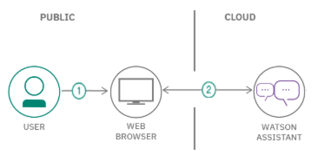

# Create a Chatbot experience to help students learning remotely to find courses and develop curriculums

 

  

 

## Description
In the era of ever-evolving digital transformation, the interaction between users and websites has become important and has become one of the key aspects of providing a satisfying experience. To increase interaction and provide more efficient service. Many companies and organizations have adopted chatbot technology as an innovative solution.
Online New Student Admission (PPDB), as a platform used by students who wish to enroll in their  school, provides information about new student registration and online registration services. To improve convenience in the process of registering new students, a new feature was created, namely a chatbot that uses services from IBM Cloud, namely the Watson Assistant. Watson Assistant is a service from IBM powered by powerful artificial intelligence, which enables the building of intelligent and responsive chatbots. By utilizing Watson Assistant as a chatbot, it is hoped that the registration process and the information needed by students can be fulfilled.
The SiPens chatbot created using the Watson Assistant service has the ability to naturally understand user questions and requests. Using natural language processing and machine learning, these chatbots can provide accurate and relevant responses.

## Flow

 

## Included components

* [IBM Watson Assistant](https://www.ibm.com/cloud/watson-assistant/): Build, test and deploy a bot or virtual agent across mobile devices, messaging platforms, or even on a physical robot.

## Pre-requsites

* [IBM Cloud Account](https://cloud.ibm.com/).
* Basic familiarity of [IBM Cloud](https://cloud.ibm.com/), [Assistant service](https://cloud.ibm.com/docs/assistant?topic=assistant-getting-started), [Natural Language Understanding (NLU) service](https://cloud.ibm.com/docs/services/natural-language-understanding?topic=natural-language-understanding-getting-started#getting-started) and [Discovery service](https://cloud.ibm.com/docs/discovery?topic=discovery-getting-started).

## Steps

Follow these steps to setup and run this code pattern. The steps are described in detail below.

1. [Create IBM Cloud services](#2-create-ibm-cloud-services)

2. [Configure Watson Assistant and Test the Chatbot](#5-configure-watson-assistant-and-test-the-chatbot)

## 1. Create IBM Cloud services

Create the following services:

* [**Watson Assistant**](https://cloud.ibm.com/catalog/services/assistant) 

> **NOTE**: use the `Plus` offering of Watson Assistant. You have access to a 30 day trial.

## 2. Configure Watson Assistant and test the Chatbot

### Create assistant

* Find the Assistant service in your IBM Cloud Dashboard.

* Click on the service and then click on `Launch Watson Assistant`.

* Go to your Assistant tab and click `create assistant`. 

## Troubleshooting

* Error: If you get an error that says you 
      > Traceback (most recent call last):
      > File "NLUEntityExtraction.py", line 4, in <module>
      > import pandas as pd
      > ImportError: No module named pandas

      > you need to make sure you are using the same verion of pip and python.  We recommend you use Python 3 and Pip 3

* Error: Unable to list workspaces for Watson Assistant: Forbidden: Access is denied due to invalid credentials.

  > This error occurs with `Deploy to IBM Cloud` button. Configure a runtime environment variable for `ASSISTANT_APIKEY` to allow automatic configuration of the default skill or configure `SKILL_ID` to use another skill.

* Error: Only one free environment is allowed per organization

  > To work with a free trial, a small free Discovery environment is created. If you already have a Discovery environment, this will fail. If you are not using Discovery, check for an old service thay you may want to delete. Otherwise use the .env DISCOVERY_ENVIRONMENT_ID to tell the app which environment you want it to use. A collection will be created in this environment using the default configuration.

# Related Links

- [How to get the most out of Relevancy Training](https://developer.ibm.com/dwblog/2017/get-relevancy-training/)
- [Improving result relevance with the API](https://cloud.ibm.com/docs/discovery?topic=discovery-improving-result-relevance-with-the-api)

# Learn more

* **Artificial Intelligence Code Patterns**: Enjoyed this code pattern? Check out our other [AI Code Patterns](https://developer.ibm.com/technologies/artificial-intelligence/).
* **AI and Data Code Pattern Playlist**: Bookmark our [playlist](https://www.youtube.com/playlist?list=PLzUbsvIyrNfknNewObx5N7uGZ5FKH0Fde) with all of our code pattern videos
* **With Watson**: Want to take your Watson app to the next level? Looking to utilize Watson Brand assets? [Join the With Watson program](https://www.ibm.com/watson/with-watson/) to leverage exclusive brand, marketing, and tech resources to amplify and accelerate your Watson embedded commercial solution.

# License

This code pattern is licensed under the Apache Software License, Version 2.  Separate third party code objects invoked within this code pattern are licensed by their respective providers pursuant to their own separate licenses. Contributions are subject to the [Developer Certificate of Origin, Version 1.1 (DCO)](https://developercertificate.org/) and the [Apache Software License, Version 2](https://www.apache.org/licenses/LICENSE-2.0.txt).

[Apache Software License (ASL) FAQ](https://www.apache.org/foundation/license-faq.html#WhatDoesItMEAN)
